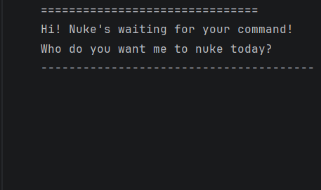

# Nuke User Guide
  
Nuke is a powerful chatbot designed for military operations. It helps you manage missions more efficiently. 
With Nuke, teams can load the ongoing strategies, add new mission, and store in its "secret" storage for security.
## Adding Task

This command can be used to add a general type mission (Task) into the current strategy.

Example: `todo {your_task_here}`

```
Receiving a pending task: secure hill A
```

## Adding Strike

This command can be used to add a Strike mission into the current strategy.

Example: `deadline {your_task_here} /by {your_task_timing}`

```
Receive a strike order: tunnel B, by 24/02/2026
```

## Adding Operation

This command can be used to add a Operation mission into the current strategy.

Example: `event {your_task_here} /from {your_task_start_timing} /to {your_task_end_timing}`

```
Receive an operation: WhiteCool, from 20/02/2026, to 20/2/2206
```
## List Mission

This command can be used to list the current strategy.

Example: `list`

```
We currently have 5 missions:
1.[T][X] secure hill A
2.[T][ ] build protocol S
3.[D][ ] tunnel B (by: 24/02/2026)
4.[E][X] WhiteCool (from: 20/02/2026 to: 20/2/2206)
5.[D][ ] Penetrate city V (by: next month)
```

## List Mission

This command can be used to exit.

Example: `bye`

The current strategy will be stored automatically for next usage.
```
Kaboommm!
I have destroyed our current session!
See you later!
```

## Mark/Unmark mission

This command can be used to mark completed missions.

Example: `mark/(unmark) {the_mission_index}`
```
Mark the mission: [T][X] secure hill A
```

## Delete mission

This command can be used to remove a mission from current strategy.

Example: `delete {the_mission_index}`
```
Delete old mission: [T][ ] build protocol S
```

## Find mission

This command can be used to find similar mission.

Example: `find {some_recognition_of_the_mission}`
```
1.[E][X] WhiteCool (from: 20/02/2026 to: 20/2/2206)
2.[D][X] Deploy the WhiteShark (from: X/X/1999 to: X/Y/3000)
You got 2 match.
```